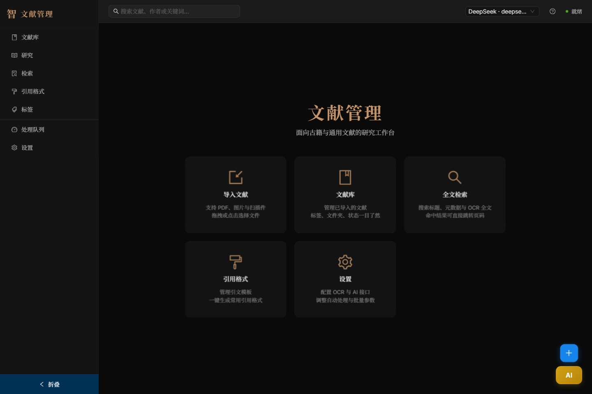
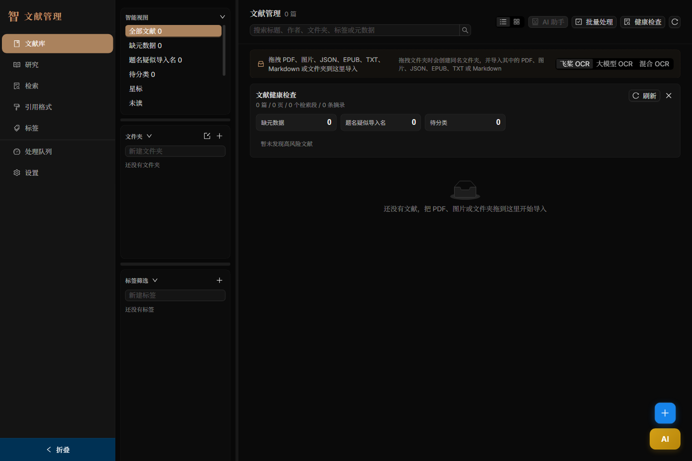
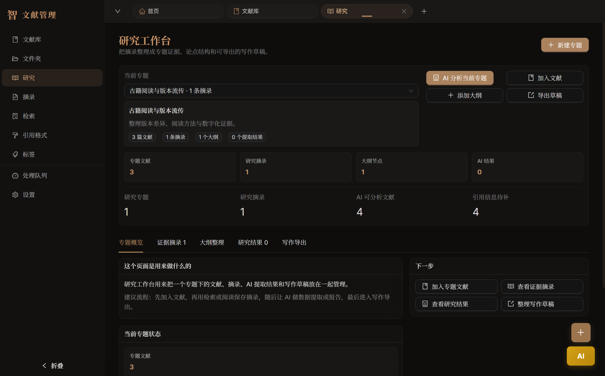
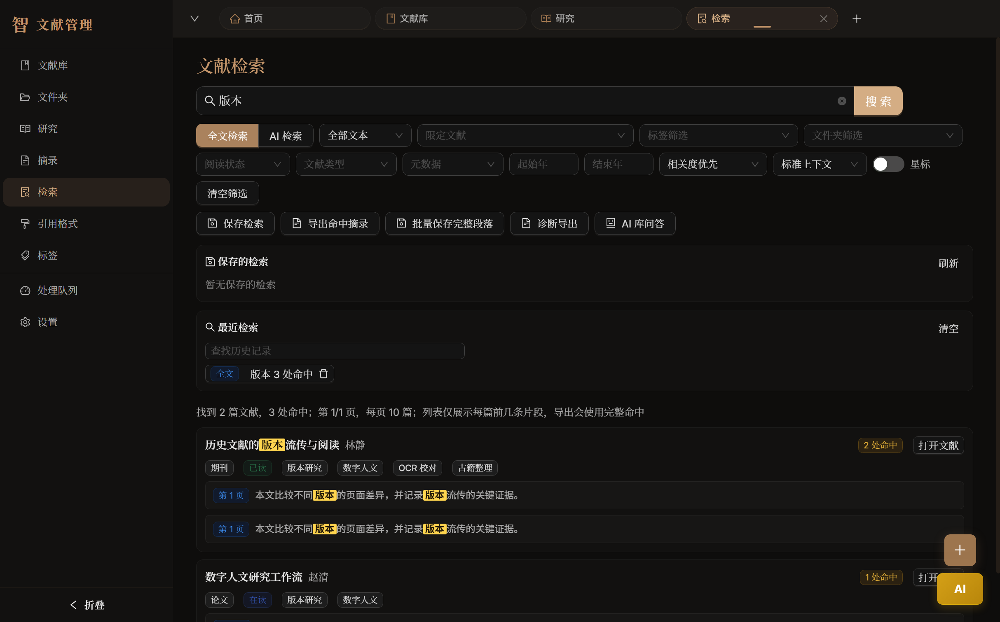
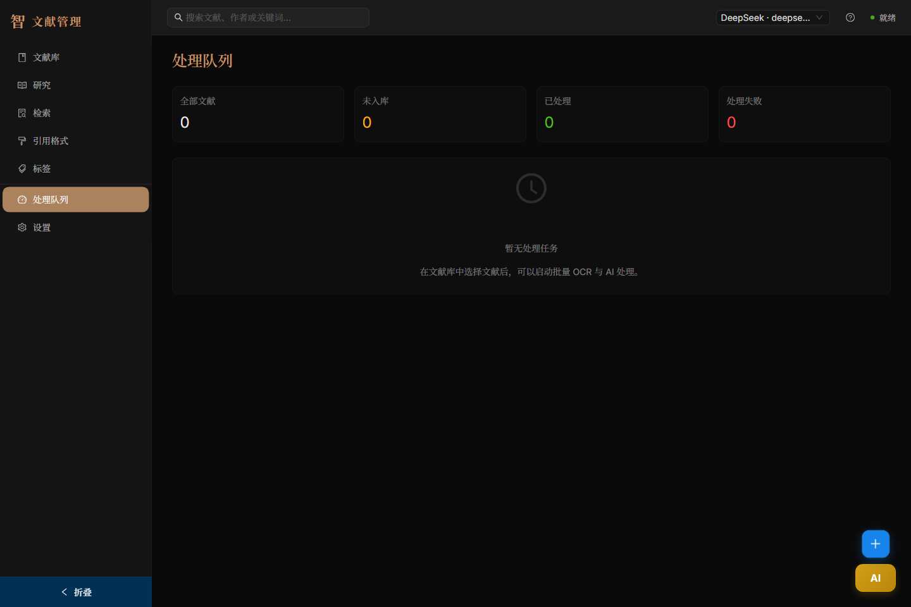
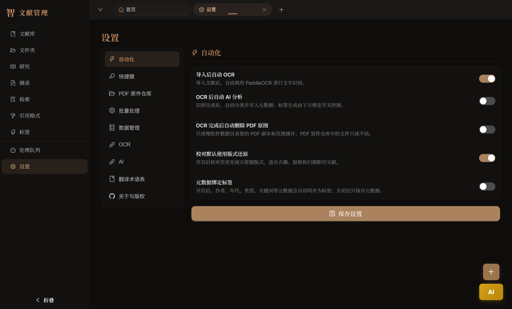

# 文献管理（GujiSmart）

文献管理（GujiSmart）是一个面向古籍与通用文献的本地研究工作台，围绕“导入资料、OCR 校对、检索证据、摘录到写作”的闭环整理个人文献库。

## 界面预览

以下截图使用空库或合成示例数据，不包含真实用户文献。

| 欢迎页 | 文献库 |
| --- | --- |
|  |  |

| 研究工作台 | 全文检索 |
| --- | --- |
|  |  |

| 引用格式 | 标签管理 |
| --- | --- |
|  |  |

| 处理队列 | 设置 |
| --- | --- |
|  |  |

## 功能概览

- 文献导入：支持 PDF、常见图片格式和本地文件夹归档。
- OCR 与校对：支持批量 OCR、页面校对、原图对照和多版本识别结果。
- 文献组织：支持标签、文件夹、收藏、阅读状态、评分和元数据维护。
- 检索与证据：支持全文检索、语义扩展检索、保存检索和摘录保存。
- AI 辅助：支持 OpenAI 兼容接口，用于元数据提取、文献问答、总结和跨文献综合。
- 研究写作：支持研究项目、摘录、引用模板和 Markdown/JSON 等导出。

## 技术栈

- 桌面框架：Electron
- 前端：React 18 + TypeScript + Vite
- UI：Ant Design 5
- 本地数据库：`better-sqlite3` + SQLite
- OCR：PaddleOCR API / 视觉模型 OCR
- AI：OpenAI 兼容接口

## 快速开始

前往 [GitHub Releases](https://github.com/DieDust/gujismart-public/releases) 下载最新安装包即可。

```bash
npm install
npm run dev
```

## 常用脚本

```bash
npm run typecheck
npm run check
npm run build
npm run smoke
```

- `npm run typecheck`：运行 TypeScript 类型检查。
- `npm run check`：运行类型检查、乱码检查和开源卫生检查。
- `npm run build`：构建 Electron main、preload 和 renderer。
- `npm run smoke`：运行 Electron 冒烟测试。

更多回归测试和脚本卫生规则见 [docs/SCRIPTS.md](docs/SCRIPTS.md)。维护者发布新版本前必须遵循 [开源发布操作规范](docs/OPEN_SOURCE_RELEASE.md)。依赖本地私有文献库的人工 QA 脚本不进入公开仓库。

## 配置说明

应用优先使用本地 SQLite 数据库保存文献、OCR 结果、标签、项目和设置。开发模式下数据位于项目内的 `data/` 目录；构建后的应用会使用 Electron 的用户数据目录。

AI/OCR 相关 API Key 不应写入仓库，请在应用设置页中配置。开源贡献时不要提交真实数据库、真实文献、用户目录、日志或临时调试输出。
如需本地调试环境变量，请复制 `.env.example` 为 `.env`，并只在本机填写真实值。

## 项目结构

```text
src/main/        Electron main 进程、数据库、OCR、AI、导出和 IPC handler
src/preload/     安全暴露给 renderer 的 window.api
src/renderer/    React 前端界面、状态和工具函数
src/shared/      main/preload/renderer 共享类型、常量和跨进程工具
scripts/         冒烟测试、回归测试和仓库维护脚本
docs/            使用文档和截图素材
```

架构边界、IPC 合同和命名规则见 [docs/ARCHITECTURE.md](docs/ARCHITECTURE.md)。脚本分类见 [docs/SCRIPTS.md](docs/SCRIPTS.md)。后续整理方向见 [docs/ROADMAP.md](docs/ROADMAP.md)。

## 更新日志

版本变化见 [CHANGELOG.md](CHANGELOG.md)。

## 开源协作

欢迎提交 issue 和 pull request。开始前请阅读 [CONTRIBUTING.md](CONTRIBUTING.md) 和 [SECURITY.md](SECURITY.md)。提交 PR 前至少运行：

```bash
npm run check
npm run build
```

## 许可证与第三方声明

本项目使用 [Apache License 2.0](LICENSE)。

项目版权和必须保留的归属声明见 [NOTICE](NOTICE)。随包第三方运行时组件、直接 npm 依赖和构建工具许可证见 [THIRD_PARTY_NOTICES.md](THIRD_PARTY_NOTICES.md)。

## 作者

- GitHub: [DieDust](https://github.com/DieDust)
